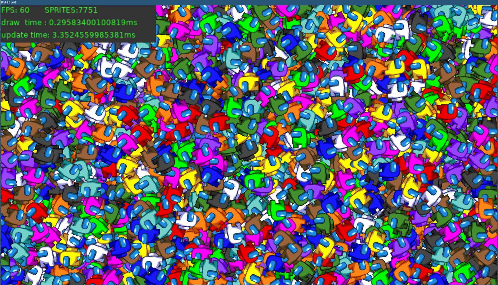

## Benchmark of Löve2D

This benchmark is based of [Coder Space's benchmark](https://github.com/StanislavPetrovV/Benchmark-2D) of game engines and graphics libraries for Python.

Note: Löve2D usually have v-sync turned on by default, which limits FPS to 60, so I turned it off in `love.load()` function.

The reason why I've decided to implement this is to see how well Löve2D can perform against Pygame in terms of performance.
The `options.lua` file has a few global variables defined in it as well as `OPTIMIZED` constant. The `OPTIMIZED` constant changes the way how every sprite is drawn onto the screen.

Here is the three levels of optimization:
- 0 - No optimizations. Every sprite is drawn onto the screen separately by indexing into a table of images and getting the image from there. The reason
- 1 - Every sprite is drawn separately, but now using ArrayImage object from Löve2D. By combining every sprite image into one ArrayImage object we can only send one texture to GPU and then just pass the index of every sprites image.
- 2 - Every sprite is drawn at once. By combining ArrayImage and SpriteBatch, we can add every sprite to SpriteBatch and just update each frame, this allows us to only make ONE drawcall to GPU.

Note2: although the process time of second optimization level is greatly lower compared to first level, in my benchmarks the FPS didn't improve by much.